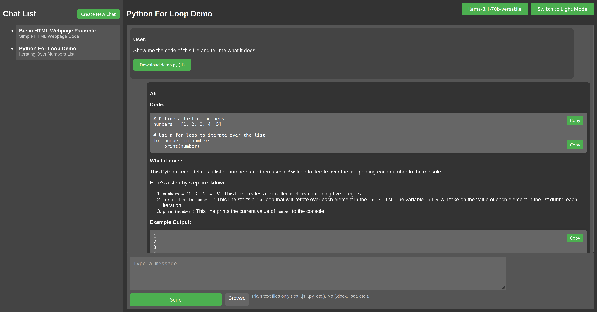
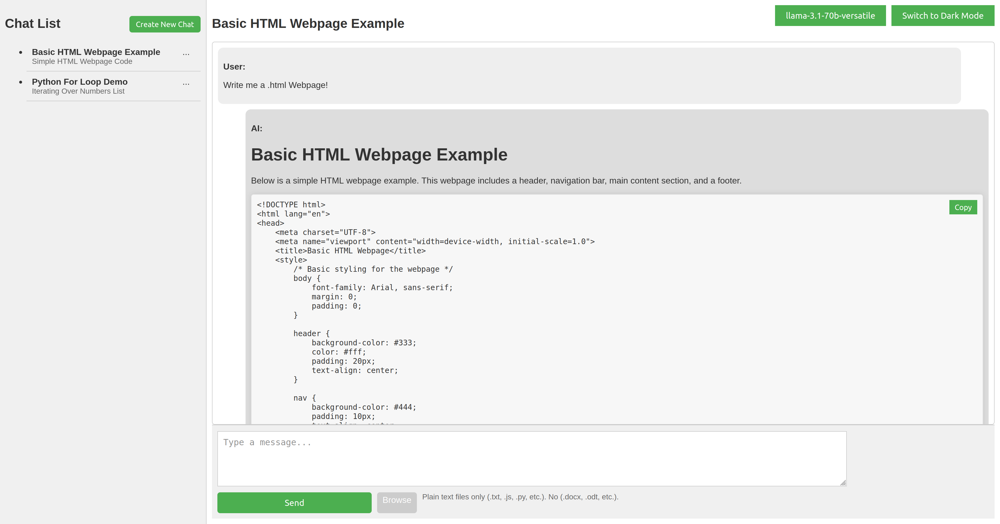

This README was written entirely by LLaMA 3.1 70B, prompted by me, makeradventures.

# README

## Introducing the Groq API Chat Application

This chat application allows users to communicate with models hosted on the Groq platform. Groq provides ultra-fast inference capabilities, making it ideal for a fast AI response in allowing for a smoother workflow when using an AI chatbot. The application uses the Groq API to interact with models hosted on the platform, providing a simple and intuitive interface for users to send messages and receive responses from the AI. It also includes features such as chat history, model selection, and error handling.

| Interface | Interface_light |
| --- | --- |
|  |  |

## Development Process and Challenges

This project was created as a fun experiment to see how well LLaMA 3.1 70B can write code. The code for this application was written by LLaMA 3.1 70B with guidance and prompts from me, makeradventures. The only rule was that I was not allowed to write any code myself, with the exception of adding debug prints and comments to help LLaMA 3.1 70B find a solution. All human intervention was limited to providing suggestions and prompts, as well as pasting relevant documentation into the prompts to help LLaMA 3.1 70B understand the task at hand. I did not write any code, and my role was solely to guide LLaMA 3.1 70B through the development process. While LLaMA 3.1 70B was able to solve most problems on its own, occasionally requiring only a nudge in the right direction, human suggestions were necessary to address issues such as code organization, variable scope, and CSS syntax. However, human suggestions regarding the codebase were kept to a minimum, and only occurred when it was unavoidable, ensuring that the primary goal of testing LLaMA 3.1 70B's capabilities remained intact. As a result, I do not feel responsible for the code structure, as it was largely generated by LLaMA 3.1 70B. One of the main challenges faced during the development process was maintaining a clean and organized codebase, as LLaMA 3.1 70B tended to generate code that was functional but not always well-structured.

## Getting Started

To get started with the application, follow these steps:

1. **Clone the repository**: Clone the repository to your local machine using your preferred method (e.g., `git clone https://github.com/makeradventures/groq-api-chat-application.git`).
2. **Install dependencies**: Install the required dependencies by running `pip install -r requirements.txt` in your terminal.
3. **Set environment variables**: Set the `GROQ_API_KEY` environment variable to your Groq API key. You can do this by adding the following line to your terminal or by setting it in your environment variables:
   * `export GROQ_API_KEY=your_api_key` (Linux/Mac)
   * `set GROQ_API_KEY=your_api_key` (Windows)
   To make this environment variable persistent across terminal sessions, you can add it to your shell configuration file. Here's how:
   * **Linux/Mac (Bash)**: Add the following line to your `~/.bashrc` file: `export GROQ_API_KEY=your_api_key`
   * **Linux/Mac (Zsh)**: Add the following line to your `~/.zshrc` file: `export GROQ_API_KEY=your_api_key`
   * **Windows**: Right-click on "Computer" or "This PC" and select "Properties". Click on "Advanced system settings" on the left side. Click on "Environment Variables". Under "System Variables", scroll down and find the "Path" variable, then click "Edit". Click "New" and enter the following: `GROQ_API_KEY=your_api_key`
4. **Run the application**: Run the application by executing `python app.py` in your terminal.
5. **Open the chat application**: The application will automatically open the chat interface in your default browser. If it doesn't, you can manually open the `index.html` file in your browser and navigate to `http://localhost:5002` to access the chat application.

## Conclusion

This project demonstrates the potential of LLaMA 3.1 70B in generating code for complex applications. While there are still limitations to its capabilities, the results of this project show that LLaMA 3.1 70B can be a valuable tool for developers.

## Disclaimer

This project was generated using LLaMA 3.1 70B accessed via Groq. I am unclear on the licensing implications of the Groq platform, as it is a third-party service.

Since I don't understand the Groq licensing situation, I do not grant permission for use or modification of this project code.

For more information on the model used in this project, please visit the model card: https://github.com/meta-llama/llama-models/blob/main/models/llama3_1/MODEL_CARD.md

